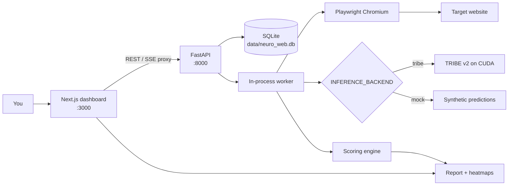
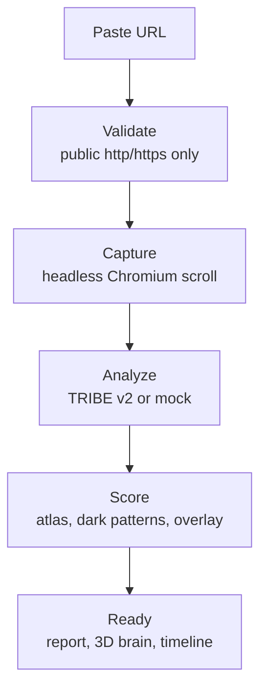

# Neuro Web

See how a website engages the brain — locally, from a URL.

Neuro Web records a page as it scrolls, runs Meta's [TRIBE v2](https://github.com/facebookresearch/tribev2) brain-encoding model on that recording, and turns the predicted cortical responses into scores, heatmaps, overlays, and a dark-pattern report. Analysis runs on your machine. There is no cloud inference path.

Paste a public `http(s)` URL. The app does the rest.

## What Neuro Web does

Neuro Web is a local analysis workbench for attention, emotion, and manipulative design. You submit a URL; a background worker captures the page, predicts fMRI-like activity on the cortical surface, and compiles a report the dashboard can explore.

The system is built around three capabilities:

**Brain mapping** — TRIBE v2 predicts per-second activation across ~20,484 vertices on the `fsaverage5` mesh (left hemisphere, then right). Video from the scroll recording and on-screen text are fused in one `predict` call the way the model was trained, not averaged after the fact. Audio is never used: the capture is silent, and the audio extractors are never loaded.

**Dark-pattern detection** — Independent of the brain model, rule-based classifiers scan page text and layout for urgency, confirmshaming, pre-checked consent, hidden costs, misdirection, and forced continuity. Matches carry evidence text, confidence, and bounding boxes when the DOM snapshot has them.

**Local by default** — Capture, inference, scoring, and storage stay on this machine. SQLite, videos, predictions, and reports live under `data/`. The only required outbound calls are fetching the URL you asked to analyze and, on first run, downloading model and atlas assets. Optional chat is the exception: if you set an LLM key, a compact copy of the report is sent to OpenAI or Anthropic so you can ask questions about it.

## How it works

### System architecture

You talk only to the Next.js app. It proxies jobs, live status, reports, the brain mesh, and chat to a FastAPI service. That service owns the job queue, Playwright capture, TRIBE (or mock) inference, and a deterministic scoring engine. A worker loop inside the API process claims queued jobs one at a time.



### Analysis pipeline

Each submission is a job with a durable status. The home page streams progress over SSE (and falls back to polling). Jobs that are mid-pipeline when the process dies are marked failed as `interrupted` on the next startup.



| Stage | What happens |
|---|---|
| `queued` → `validating` | Scheme, length, redirects, and SSRF checks. Private, loopback, and link-local hosts are rejected. |
| `capturing` | Headless Chromium loads the page, scrolls for `CAPTURE_DURATION` seconds (default 30), records video, a full-page screenshot, a DOM snapshot (`dom.json`), and a scroll timeline. Video is transcoded to MP4. |
| `analyzing` | TRIBE v2 (or the mock backend) writes one prediction row per second on the cortical mesh, aligned to scroll position with a 5s hemodynamic offset. |
| `scoring` | Desikan–Killiany regions on `fsaverage5` become 0–10 scores, a scroll timeline with peaks, a page overlay, dark-pattern matches, and 2D projections. |
| `ready` | The results page loads `report.json` plus the 3D mesh. |

### Capture

The capture is a controlled reading of the page, not a full crawl.

- Viewport defaults to 1440×900.
- Scroll is sampled ~10 times per second so later stages can map brain time back to on-screen content.
- The DOM snapshot records regions, controls, and text blocks with page-space bounding boxes.
- Redirects, video size, and screenshot height are capped so a hostile or enormous page cannot blow the disk.

Those artifacts are the only inputs to inference and scoring.

### TRIBE v2 inference

TRIBE v2 is Meta's multimodal brain encoder: V-JEPA 2 for video, Llama 3.2-3B for text, fused by a transformer onto the cortical surface. Neuro Web does **not** use the stock `get_events_dataframe` helper, which would run TTS and whisperx to time words from audio. A silent screen recording has no soundtrack, so Neuro Web builds the event table itself:

1. A **Video** event covers the recording (chunked to stay inside TRIBE's window).
2. **Word** events are scheduled by simulating a reader at `TEXT_READING_WPM` (default 240) as blocks enter the viewport. A rolling `TEXT_CONTEXT_WORDS` window (default 256) is the language-model context for each word.
3. One `TribeModel.predict` call consumes both modalities on a shared timeline.

Set `TRIBE_MODALITIES=video` to skip Llama entirely. That roughly halves peak VRAM and does not need a Hugging Face token. Video+text wants ~16 GB; video-only can run on ~8 GB.

Weights load in the background after the API starts. Analyses you submit while the model is loading wait until it is ready. The home page banner reports that state.

### Scoring engine

Predicted responses are z-scored, fMRI-like values — **model output, not measurements from a person**, and not a clinical claim.

A network's raw activation is mapped to 0–10 by comparing it with other cortical regions **on the same page**. A 5 means "typical for this capture"; the tails are networks that stand out here, not a universal brain-impact scale.

| Score | Meaning |
|---|---|
| Attention | Visual + attention networks |
| Emotion | Emotional network |
| Temporal variance | How much overall activation fluctuates over the scroll |
| Impact | `0.4 × attention + 0.4 × emotion + 0.2 × temporal variance` |

The engine also emits a per-region Desikan–Killiany breakdown, per-second series, peak annotations on the scroll timeline, and an overlay that paints DOM boxes by the activation of the timesteps when they were on screen.

### Mock backend

`INFERENCE_BACKEND=mock` (or `make run-mock`) produces deterministic synthetic predictions so you can exercise capture, scoring, and the UI without a GPU. Values are seeded from the job id and shaped by scroll speed, on-screen controls, and text density. Reports are labelled `inference_backend: mock`, the home page banner warns you, and the optional chatbot is instructed to say the numbers are placeholders.

Use mock to develop and demo the product. Do not treat mock scores as TRIBE output.

## What you get

Once a job is `ready`, the results page has four views plus optional chat:

| View | Contents |
|---|---|
| **Report card** | Impact, attention, emotion, temporal variance, network breakdown, dark-pattern summary |
| **Brain heatmap** | Interactive `fsaverage5` mesh (Three.js) colored by predicted activation, with 2D projections as a fallback |
| **Website overlay** | Screenshot with element boxes weighted by attention/emotion contribution |
| **Scroll timeline** | Per-second intensity with peak markers tied to scroll position |
| **Chat** | Optional. Asks questions against this report only; requires `LLM_API_KEY` |

Past jobs live on `/history`.

## Tech stack

| Layer | Technology |
|---|---|
| Dashboard | Next.js 16, React 19, Tailwind CSS 4, Three.js / React Three Fiber, Recharts |
| API | FastAPI, Uvicorn, SSE (`sse-starlette`), Pydantic |
| Jobs & files | SQLite (aiosqlite, WAL), local `data/` tree |
| Capture | Playwright Chromium, FFmpeg transcode to MP4 |
| Brain model | [TRIBE v2](https://huggingface.co/facebook/tribev2) (`facebook/tribev2`) on CUDA PyTorch 2.5 |
| Atlas & mesh | Desikan–Killiany on `fsaverage5` via nibabel / nilearn, GLB export with trimesh |
| Optional chat | OpenAI- or Anthropic-compatible streaming APIs |

## Prerequisites

- **Python 3.11+** and **Node.js 20+** (with npm)
- **Git**
- **FFmpeg** on `PATH` (recommended — transcodes Playwright’s WebM to MP4 so TRIBE can read duration; the pipeline falls back to WebM if FFmpeg is missing)
- **NVIDIA GPU + CUDA** for real TRIBE inference
  - ~16 GB VRAM for `video,text` (recommended 24 GB)
  - ~8 GB VRAM if you set `TRIBE_MODALITIES=video`
- **Hugging Face token** only if the text modality is on, plus access to [`meta-llama/Llama-3.2-3B`](https://huggingface.co/meta-llama/Llama-3.2-3B)
- Optional: **OpenAI or Anthropic API key** for report chat

No GPU? You can still install the stack and run `make run-mock`.

## Setup

```bash
git clone https://github.com/Haaris-7/Neuro-Web.git
cd Neuro-Web
```

**Guided install** (checks the machine, writes `.env`, installs Python + Node deps, optionally clones TRIBE v2):

```bash
make setup-interactive
```

**Non-interactive install:**

```bash
make setup
make check-gpu          # CUDA machines
make setup-tribe        # clones facebookresearch/tribev2 and `pip install -e`
make prefetch           # atlas + brain mesh (otherwise built on first request)
```

`make setup` copies `.env.example` to `.env` if needed. Then:

1. Set `HF_TOKEN` if you will run `TRIBE_MODALITIES=video,text`.
2. Accept the Llama 3.2 license at the Hugging Face link above.
3. Optionally set `LLM_API_KEY` and `LLM_PROVIDER`.
4. On a CUDA box, install a **CUDA build** of PyTorch that matches your driver (the interactive script asks; see [pytorch.org](https://pytorch.org/get-started/locally/)). TRIBE pins `torch>=2.5.1,<2.7`.

First TRIBE start downloads weights into `data/cache/tribe`. That can take a while and a few gigabytes of disk.

## How to run

| Command | Purpose |
|---|---|
| `make run` | Start API (`:8000`) and Next.js (`:3000`) |
| `make run-backend` | API only |
| `make run-frontend` | Dashboard only (expects the API on `BACKEND_URL`) |
| `make run-mock` | Same as `make run` with `INFERENCE_BACKEND=mock` |
| `make setup-interactive` | Guided environment setup |
| `make check-gpu` | CUDA / VRAM report for TRIBE |
| `make prefetch` | Download atlas and export the GLB mesh |
| `make lint` | Frontend `tsc` + eslint, backend `compileall` |
| `make clean` | Delete captures, predictions, and reports |
| `make clean-all` | Also wipe the model / atlas / mesh cache |

Open [http://localhost:3000](http://localhost:3000). Health and model state: [http://localhost:8000/health](http://localhost:8000/health). FastAPI docs: [http://localhost:8000/docs](http://localhost:8000/docs).

Keep both processes up. The dashboard talks to the API through Next.js routes (`/api/jobs`, `/api/health`, `/api/mesh`, `/api/chat`, …). If the API is down, the home page says so.

## Using Neuro Web

1. Confirm the banner: **TRIBE v2 ready**, **synthetic inference**, or **model loading**.
2. Paste a public URL (private and localhost addresses are blocked).
3. Wait through Validating → Capturing → Analyzing → Scoring. Analyzing is the slow step on GPU.
4. When the job is ready you land on the results page. Switch tabs for the report, 3D brain, overlay, and timeline.
5. If chat is configured, open the panel and ask about *this* report (scores, regions, peaks, evidence). The assistant is grounded in the JSON and should refuse to invent findings.

Submit another URL from home, or reopen an old job from **Analysis History**.

## Configuration

All settings are environment variables (see `.env.example`). The important ones:

| Variable | Default | Role |
|---|---|---|
| `INFERENCE_BACKEND` | `tribe` | `tribe` or `mock` |
| `TRIBE_MODALITIES` | `video,text` | Comma-separated; `video` skips Llama and `HF_TOKEN` |
| `TRIBE_MODEL_ID` | `facebook/tribev2` | Hugging Face model id |
| `HF_TOKEN` | empty | Required for the gated text encoder |
| `TEXT_READING_WPM` | `240` | Simulated reader speed for Word events |
| `TEXT_CONTEXT_WORDS` | `256` | Rolling LM context per word |
| `LLM_API_KEY` | empty | Enables report chat |
| `LLM_PROVIDER` | `openai` | `openai` or `anthropic` |
| `CAPTURE_DURATION` | `30` | Scroll length in seconds |
| `CAPTURE_VIEWPORT_W` / `_H` | `1440` / `900` | Capture viewport |
| `DATA_DIR` | `./data` | Jobs, artifacts, SQLite |
| `BACKEND_URL` | `http://localhost:8000` | Next.js → API |

## Project structure

```
.
├── backend/
│   ├── main.py                 # FastAPI app, lifespan, worker, model load
│   ├── worker.py               # Job pipeline: validate → capture → infer → score
│   ├── config.py               # Environment-backed settings
│   ├── database.py             # SQLite jobs table
│   ├── api/                    # Jobs, SSE, files, atlas/mesh, chat
│   ├── pipeline/
│   │   ├── capture.py          # Playwright scroll recording + DOM snapshot
│   │   ├── inference.py        # TRIBE or mock → predictions.npz
│   │   ├── tribe_events.py     # Video + scheduled Word events (no audio)
│   │   ├── mock_backend.py     # GPU-free synthetic cortex
│   │   └── model_manager.py    # Singleton load + /health
│   └── engine/                 # Deterministic scoring, atlas, overlay, report
├── frontend/
│   ├── app/                    # Home, analysis progress, results, history
│   ├── app/api/                # Reverse proxy to the FastAPI service
│   └── components/             # URL input, progress, 3D brain, overlay, chat
├── scripts/
│   ├── setup.sh                # Interactive installer
│   ├── check_gpu.py            # CUDA / VRAM check
│   └── prefetch_assets.py      # Atlas + GLB mesh
├── Makefile
└── .env.example
```

On-disk artifacts after a run:

```
data/
├── neuro_web.db
├── captures/<job_id>/          # capture.mp4, page.png, dom.json, scroll_timeline.json
├── predictions/<job_id>/       # predictions.npz, segment_alignment.json
├── reports/<job_id>/           # report.json, projections, vertex colors
└── cache/                      # TRIBE weights, atlas, fsaverage5.glb
```

## GPU notes

`make check-gpu` prints devices and a rough fit estimate. Extractors load and free in sequence, so peak VRAM is closer to the largest encoder than to the sum of all of them.

If you OOM on video+text, set `TRIBE_MODALITIES=video` and restart the API. If you have no NVIDIA GPU, use `make run-mock` and keep `INFERENCE_BACKEND=mock` in `.env`.

## License and scientific scope

Neuro Web's application code in this repository is what you see in the tree. TRIBE v2 weights and the `tribev2` package are released by Meta under **CC BY-NC 4.0** (non-commercial). Respect that license if you run `INFERENCE_BACKEND=tribe`.

Predictions are an in-silico encoding model's response to a screen recording. They are not EEG, not fMRI from a volunteer, and not a diagnosis. Dark-pattern hits are regex- and heuristic-based, not a legal determination. The optional chatbot is instructed to stay inside the report JSON and to flag mock runs.

## Links

- [TRIBE v2 code](https://github.com/facebookresearch/tribev2)
- [TRIBE v2 weights](https://huggingface.co/facebook/tribev2)
- [TRIBE v2 paper](https://arxiv.org/abs/2605.04326)
- [Meta announcement](https://ai.meta.com/blog/tribe-v2-brain-predictive-foundation-model/)
